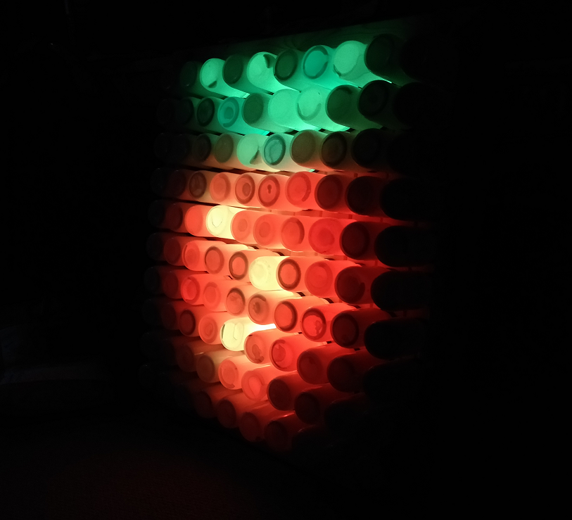

# LED-Pixel-Art
A simple Python program that pulls out RGB values from a 10 x 10 pxel JPEG image and then writes them to an LED display.

I built a 10 x 10 LED board then used Python to display JPEGSs in real time.  The LEDs are GRB so the program code has to covert them into the 
correct RGB order first.

Uses the Pimoroni UnicornHAT Python library to drive the LEDs

Install libs:
* sudo pip3 install pil (pre installed on Pi)
* curl -sS https://get.pimoroni.com/unicornhat | bash 

More build details here: https://www.tecoed.co.uk/led-board.html

YouTube - https://www.youtube.com/watch?v=IQs2gBY1vNs&feature=youtu.be

Hackster.io 

